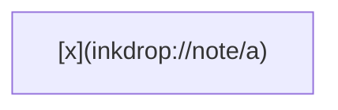

Inline `[x](inkdrop://note/a)` and math $[x](inkdrop://note/a)$ stay.

```mermaid
graph TD
  A["[x](inkdrop://note/a)"]
```

$$
\text{inkdrop://note/a}
$$

    indented [x](inkdrop://note/a)

Real link [Alpha](inkdrop://note/a).
